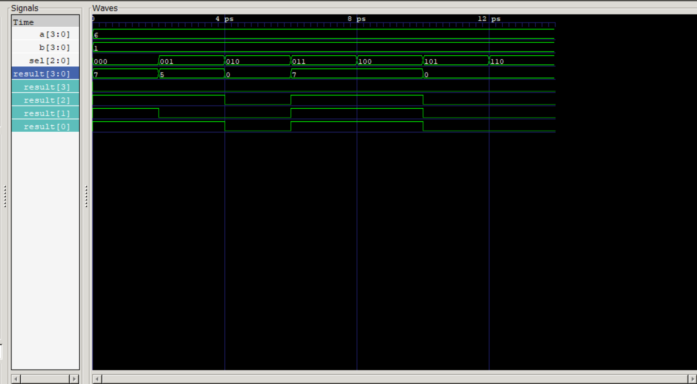

# 4-Bit ALU in Verilog

This project implements a simple **4-bit Arithmetic Logic Unit (ALU)** using Verilog. The ALU performs six basic operations based on a 3-bit control input (`sel`). Simulation is done using **Icarus Verilog**, and waveforms are visualized with **GTKWave**.

---

## Features

- **4-bit operands**: `a` and `b`
- **3-bit control input (`sel`)** for operation selection
- Supported operations:
  - `000` → ADD
  - `001` → SUBTRACT
  - `010` → AND
  - `011` → OR
  - `100` → XOR
  - `101` → SLT (Set Less Than)
- `default`: result set to `4'b0000` for unsupported operations

---

## 📸 Simulation Output

Here’s the ALU waveform showing all operations:

______________________________________________________________________________________

# 32×32 Register File in Verilog

This module implements a simple **32-register file**, each **32 bits wide**, with:

- Dual combinational read ports
- Single clocked write port
- Optional hardwired `x0` register that is always `0`

## Features

- **Inputs:**
  - `clk`: Clock signal
  - `write_enable`: Enables write when high
  - `write_address`: Address to write into
  - `write_data`: Data to write
  - `read_address1`, `read_address2`: Register addresses to read
- **Outputs:**
  - `read_data1`, `read_data2`: Data read from selected registers
- **Behavior:**
  - On positive clock edge, if `write_enable == 1` and `write_address != 0`, writes `write_data` into `registers[write_address]`
  - Reads happen immediately (combinational)

---

## Register File Testbench

The testbench:
- Generates a clock
- Writes `32'ABCDEF47` to register 5
- Reads back from register 5 and 0
- Displays both results
- Dumps waveforms to `regfile_test.vcd`

Example waveform from GTKWave:

>  `reg[5] = ABCDEF47`, `reg[0] = 00000000`

---

## Tools Used

- **Icarus Verilog** – compilation & simulation  
- **GTKWave** – waveform viewer  
- **VS Code** – development

